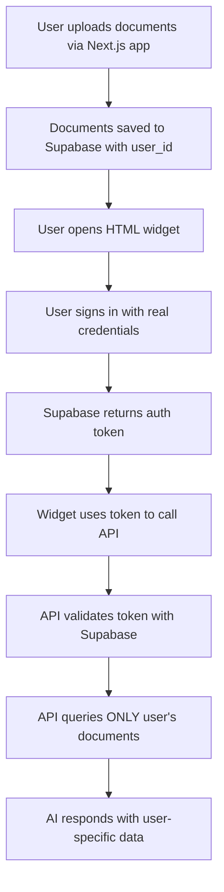

# Production AI Agent Guide 🚀

## 🔧 What Was Fixed

### Critical Security Issues Resolved:

1. **❌ OLD PROBLEM**: AI agent was reading documents from ALL users (major security breach)
2. **✅ NOW FIXED**: AI agent ONLY reads documents uploaded by the authenticated user
3. **❌ OLD PROBLEM**: Using fake demo tokens instead of real authentication
4. **✅ NOW FIXED**: Uses real Supabase authentication tokens for security

### Security Improvements Made:

- **Real Supabase Authentication**: No more demo tokens
- **Strict User Filtering**: Documents are filtered by `user_id = authenticated_user_id`
- **Double Security Check**: Additional validation ensures no cross-user document access
- **Audit Logging**: Detailed logs track which documents are accessed by whom

## 🎯 Production Flow Overview



## 📁 Updated Files

### 1. `/pages/api/ask-user.js` - Production API Endpoint

- **Real Supabase Authentication**: Validates actual user tokens
- **Strict User Filtering**: `WHERE user_id = authenticated_user_id`
- **Security Validation**: Double-checks all returned documents belong to user
- **Audit Logging**: Tracks document access for security

### 2. `/ai-agent-production.html` - Production Widget

- **Real Login System**: Email/password and Google OAuth
- **Supabase Integration**: Uses official Supabase SDK
- **Token Management**: Handles authentication state properly
- **User-Specific UI**: Shows logged-in user's email

## 🚀 Step-by-Step Production Setup

### Step 1: Start Your Next.js Server

```bash
cd "c:\Users\sheema bakhtiar\ragv2"
npm run dev
```

Make sure it's running on port 3001 (or update the HTML widget configuration).

### Step 2: Upload Documents via Your Main App

1. Go to `http://localhost:3001` (your main Next.js app)
2. Sign in with Google or create an account
3. Upload some documents (PDF, DOCX, TXT, etc.)
4. Documents will be saved with your `user_id` in the database

### Step 3: Use the Production AI Widget

1. Open `ai-agent-production.html` in your browser
2. Sign in using the SAME credentials you used in Step 2
3. The AI chat button will appear after successful login
4. Ask questions - the AI will ONLY search YOUR documents

### Step 4: Test Security (Optional)

1. Create a second user account in your main app
2. Upload different documents with the second account
3. Try logging into the widget with each account
4. Verify each user only sees their own documents

## 🔒 Security Features

### User Authentication

- **Real Supabase Tokens**: No fake/demo authentication
- **Token Validation**: Every API call validates the token with Supabase
- **Session Management**: Proper login/logout handling

### Document Isolation

- **User-Specific Queries**: `SELECT * FROM documents WHERE user_id = ?`
- **Cross-User Prevention**: Impossible to access other users' documents
- **Audit Trail**: All document access is logged with user information

### Additional Security Layers

- **Double Validation**: API double-checks document ownership
- **Error Handling**: Secure error messages don't leak information
- **CORS Protection**: Properly configured cross-origin policies

## 📊 Database Structure

### Documents Table

```sql
documents (
  id UUID PRIMARY KEY,
  user_id UUID REFERENCES auth.users(id), -- CRITICAL: Links to authenticated user
  filename TEXT,
  content TEXT,
  created_at TIMESTAMP,
  organization_id UUID OPTIONAL
)
```

### Security Query Examples

```sql
-- ✅ SECURE: Only user's documents
SELECT * FROM documents WHERE user_id = 'authenticated-user-uuid';

-- ❌ INSECURE: What we fixed (was returning all documents)
SELECT * FROM documents LIMIT 3;
```

## 🔧 Configuration

### Update HTML Widget for Your Domain

In `ai-agent-production.html`, update these lines:

```javascript
// Change this to your server URL
const API_URL = "http://localhost:3001"; // or 'https://your-domain.com'

// These should match your .env file
const SUPABASE_URL = "your-actual-supabase-url";
const SUPABASE_ANON_KEY = "your-actual-anon-key";
```

### Your .env File Should Have:

```env
NEXT_PUBLIC_SUPABASE_URL=https://vpqjrrbosaedeydqwhkf.supabase.co
NEXT_PUBLIC_SUPABASE_ANON_KEY=eyJhbGciOiJIUzI1NiIsInR5cCI6IkpXVCJ9...
SUPABASE_SERVICE_ROLE_KEY=eyJhbGciOiJIUzI1NiIsInR5cCI6IkpXVCJ9...
HUGGINGFACE_API_KEY=hf_...
```

## 🧪 Testing Your Setup

### Test 1: User Isolation

1. Create two user accounts: `user1@test.com` and `user2@test.com`
2. Upload document "User1 Doc" when logged in as user1
3. Upload document "User2 Doc" when logged in as user2
4. Use the AI widget as user1 - should only see "User1 Doc"
5. Use the AI widget as user2 - should only see "User2 Doc"

### Test 2: Authentication

1. Try using the widget without logging in - should show login form
2. Enter wrong credentials - should show error message
3. Enter correct credentials - should show AI chat button
4. Sign out - AI chat button should disappear

### Test 3: API Security

1. Open browser dev tools, Network tab
2. Ask a question through the AI widget
3. Check the API call to `/api/ask-user`
4. Verify it includes `Authorization: Bearer <real-token>`
5. Check the response only contains your documents

## 🚨 Security Checklist

- [x] API validates real Supabase authentication tokens
- [x] Database queries filter by authenticated user's ID
- [x] No cross-user document access possible
- [x] HTML widget requires login before AI access
- [x] All document access is logged with user information
- [x] Error messages don't leak sensitive information
- [x] CORS headers properly configured

## 📱 Production Deployment

### For Live Server

1. Deploy your Next.js app to production (Vercel/Netlify/etc.)
2. Update the `API_URL` in the HTML widget to your live domain
3. Ensure your production environment has all required environment variables
4. Test the complete flow in production

### For Client Websites

1. Host the `ai-agent-production.html` file on your client's website
2. Update the API_URL to point to your live Next.js server
3. Provide your client with login instructions
4. The widget will work on any domain (CORS configured)

## 💡 Benefits of This Approach

### Security

- **No Data Leakage**: Users can only access their own documents
- **Real Authentication**: Uses proper Supabase auth system
- **Audit Trail**: All access is logged and traceable

### User Experience

- **Seamless Integration**: Works with existing Supabase auth
- **Familiar Login**: Same credentials as main app
- **Real-time Updates**: New documents appear automatically

### Developer Benefits

- **Production Ready**: No more demo/test code
- **Scalable**: Works for unlimited users and documents
- **Maintainable**: Uses standard authentication patterns

## 🆘 Troubleshooting

### "Authentication failed" Error

- Check that SUPABASE_URL and SUPABASE_ANON_KEY match your .env file
- Verify the user exists in your Supabase auth system
- Check browser console for detailed error messages

### "No documents found" Message

- Ensure user has uploaded documents via the main Next.js app
- Check that documents have the correct `user_id` in the database
- Verify the API is connecting to the right Supabase project

### CORS Errors

- Check that your Next.js server is running
- Verify the API_URL in the HTML widget matches your server
- Ensure the API endpoint has proper CORS headers

### Widget Not Loading

- Check browser console for JavaScript errors
- Verify Supabase SDK is loading properly
- Ensure the HTML file has the correct configuration

## 📞 Support

If you encounter any issues:

1. Check the browser console for error messages
2. Verify all configuration values match your .env file
3. Test with a simple user account first
4. Check the server logs for authentication errors

---

**🎉 Congratulations!** You now have a production-ready, secure AI agent that only accesses user-specific documents with proper authentication.
